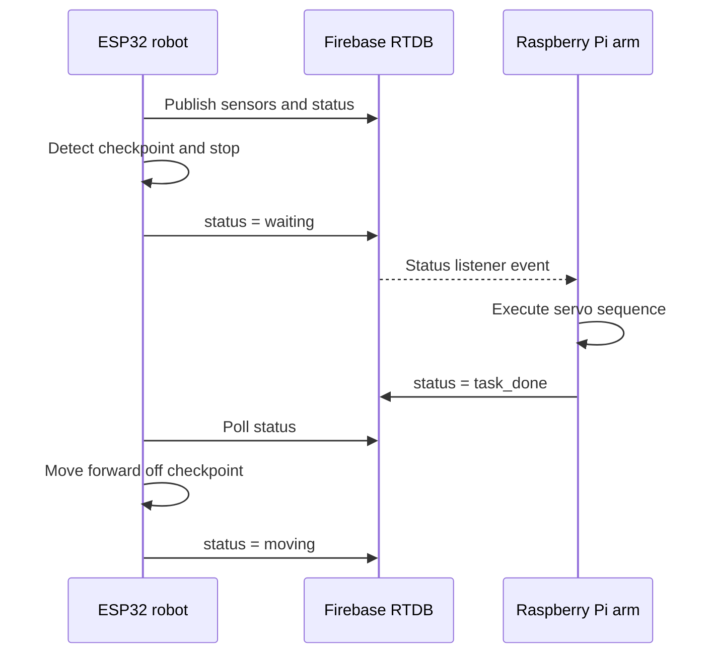

# ESP32 and Firebase Robot Coordination
### Bachelor thesis · Constructor University Bremen · 2025

A low-cost robotics prototype connecting an ESP32 mobile robot and a Raspberry Pi servo arm through Firebase Realtime Database. The mobile robot follows an IR track, reports sensor data, and requests an arm task when it reaches a checkpoint.

**Engineering focus:** embedded C++, sensor acquisition, PWM actuation, distributed state coordination, and telemetry.

[Watch the project demo](https://github.com/user-attachments/assets/2d8776ab-ac26-4926-aea7-3334b16dde35) · [Repository video](assets/20250515_033234%20%281%29.mp4)

## Repository scope

This repository contains the **ESP32 firmware and Raspberry Pi arm controller**. A Flutter monitoring/control app was part of the thesis system, but its source is not included here. The database interface below can be used to inspect the firmware without that app.

## Coordination flow



The ESP32 polls database values; the arm uses a status listener. Coordination passes through a central cloud database. This is a network-dependent prototype, without hard real-time guarantees.

## Implementation

| Component | Source | Responsibilities |
| --- | --- | --- |
| ESP32 main loop | [esp32_thesis_car.ino](src/esp32_thesis_car.ino) | Manual/auto modes, checkpoint state, telemetry and diagnostics |
| Motor driver | [motor_control.h](src/motor_control.h) | TB6612FNG direction and PWM |
| Sensors | [sensor_readings.h](src/sensor_readings.h) | IR, ultrasonic and MPU6050 setup |
| Database helpers | [firebase_setup.h](src/firebase_setup.h), [robot_utils.h](src/robot_utils.h) | Anonymous authentication, reads and initial state |
| Network/time | [wifi_setup.h](src/wifi_setup.h), [time_sync.h](src/time_sync.h) | Wi-Fi and NTP |
| Arm | [robot_arm_thesis.py](arm/robot_arm_thesis.py) | Firebase listener and scripted PCA9685 servo motions |

Pitch and roll are estimated from accelerometer readings. The arm runs a predefined joint sequence; it does not implement inverse kinematics or feedback-based grasp detection.

## Hardware

ESP32 board, TB6612FNG, two DC motors, two IR sensors, HC-SR04-compatible ultrasonic sensor, MPU6050, Raspberry Pi, PCA9685, and six servos.

| ESP32 signal | GPIO |
| --- | --- |
| Left motor AIN1 / AIN2 / PWMA | 26 / 27 / 14 |
| Right motor BIN1 / BIN2 / PWMB | 25 / 33 / 12 |
| Motor standby | 32 |
| Left / right IR | 35 / 34 |
| Ultrasonic trigger / echo | 18 / 19 |

Check sensor voltage levels, board-specific pin restrictions, and I²C wiring before powering the hardware. Servo power must be sized for the arm and share ground with the controller. Calibrate joint limits and support the arm before testing motion.

## Setup

```bash
git clone https://github.com/sushanmali50/esp32_firebase_thesis.git
cd esp32_firebase_thesis
cp src/secrets.example.h src/secrets.h
```

Set the Wi-Fi credentials, Firebase API key, and RTDB URL in the ignored `src/secrets.h`.

Create your own Firebase project, enable RTDB and anonymous authentication for the ESP32, and configure database access for the devices you authorize. The Raspberry Pi uses a service-account credential; keep that JSON outside the repository.

### ESP32 firmware

The code uses the Arduino ESP32 core and these libraries:

- Firebase Arduino Client Library for ESP8266 and ESP32 (`Firebase_ESP_Client.h`)
- Adafruit MPU6050
- Adafruit Unified Sensor and required Adafruit dependencies

Exact versions from the original hardware run are not recorded. No PlatformIO configuration is included.

For Arduino IDE, create a sketch folder named `esp32_thesis_car` outside the clone, copy the `.ino` and all headers from `src/` into it, and open `esp32_thesis_car.ino`. Select your actual ESP32 board and port, then compile and upload. Open the serial monitor at **115200 baud**.

### Raspberry Pi arm

Enable I²C and install the controller dependencies:

```bash
python3 -m venv .venv
source .venv/bin/activate
python -m pip install -r arm/requirements.txt
export GOOGLE_APPLICATION_CREDENTIALS="/absolute/path/to/service-account.json"
export FIREBASE_DATABASE_URL="https://YOUR_DATABASE.firebasedatabase.app/"
python arm/robot_arm_thesis.py
```

Starting the script moves the arm to its configured initial pose. The sequence and shutdown pose are specific to the original mechanism.

## Database contract

| Path | Type / values | Purpose |
| --- | --- | --- |
| `/robot/mode` | `manual`, `auto` | Operating mode |
| `/robot/command` | `forward`, `backward`, `left`, `right`, `stop` | Manual motion |
| `/robot/speed` | Integer, 0–255 intended | PWM demand |
| `/robot/status` | `moving`, `waiting`, `task_done` | Coordination state |
| `/robot/sensors/ir_left`, `ir_right` | `Black` / `White` | IR telemetry |
| `/robot/sensors/ultrasonic` | Integer centimeters | Distance |
| `/robot/orientation/pitch`, `roll` | Degrees | Accelerometer-derived orientation |
| `/robot/logs` | Timestamp-keyed messages | Events |
| `/task_metrics/completion_times` | Milliseconds | Checkpoint-to-completion duration |
| `/metrics/memory_usage` | Bytes | Free heap |

Boot initializes manual mode, a stop command, speed 180, and status `moving`. A status of `moving` therefore does not prove physical motion. Auto mode stops at distances ≤20 cm and uses both IR detections as a checkpoint.

## Results and reproducibility

The original project README reported the following thesis-run observations:

| Observation | Previously reported value |
| --- | --- |
| Ultrasonic update interval | Approximately 590 ms |
| App-to-ESP latency | Mean 326 ms; minimum 16 ms; maximum 889 ms |
| ESP32 free heap | 203.2–203.6 KB |

Raw measurement logs and the thesis PDF are not committed here, so these are historical reported values, not reproduced benchmarks. The current latency instrumentation uses second-resolution time and 32-bit millisecond arithmetic; it needs correction before drawing new latency conclusions. The 300 ms database interval is a scheduling target, not a guaranteed control-loop period.

## Known limitations

- Blocking network calls and delays affect responsiveness; no independent command-loss watchdog is implemented.
- A single shared status field has no task IDs, acknowledgement recovery, or duplicate-task protection.
- Right IR telemetry and autonomous control use different polarity interpretations; verify and unify these for your sensors.
- The arm publishes `task_done` before returning to its default pose.
- The ultrasonic read has no explicit short timeout.
- Full firmware compilation, device behavior, and Firebase integration have not been revalidated during the documentation cleanup.

Next work: recoverable task state machine, bounded sensor/network waits, corrected timestamp measurement, and a reproducible hardware test record.

## Academic context

**Sushan Mali**, B.Sc. Robotics and Intelligent Systems, Constructor University Bremen (2025). Bachelor thesis project on real-time data visualization and coordination in low-cost IoT robots via Firebase; supervised by Fangning Hu.
